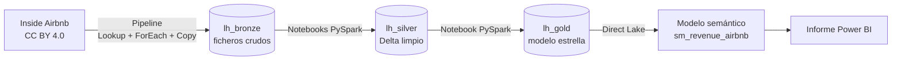

# Revenue Intelligence sobre Inside Airbnb

Proyecto de portfolio de **analítica de revenue para alquiler turístico**, construido de extremo a extremo en **Microsoft Fabric**: ingesta reproducible, arquitectura medallion (bronze, silver, gold), modelo semántico **Direct Lake** y un informe de Power BI pensado para propietarios de pocos pisos.

> **Estado:** en construcción. Funcionan la ingesta, silver (`listings` y `calendar`), el gold, el modelo y un informe de 3 páginas. Pendientes: reseñas como proxy de demanda, seguridad por filas (RLS) y alertas de calidad.

## Qué responde

Con datos abiertos de **Barcelona** y **Euskadi** (23 snapshots mensuales, de julio de 2025 a junio de 2026):

- ¿Qué **ocupación aproximada** y qué **RevPAR** tiene cada ciudad y cada zona?
- ¿Cómo es la **estacionalidad**? (la ocupación a 30 días de Euskadi pasa del 76 % en julio al 36 % en diciembre)
- ¿Qué zonas tienen **muestra suficiente** (30 o más anuncios) para fiarse de su ranking?

## Arquitectura

| Capa | Contenido | Tamaño |
|---|---|---|
| **Bronze** | Los ficheros tal cual llegan (`Files/<ciudad>/<fecha>/`) | 92 ficheros, 2,1 GB |
| **Silver** | `listings` y `calendar` en Delta, tipados, con flags y validaciones, particionados por ciudad y snapshot | `calendar`: 88,7 M filas |
| **Gold** | `dim_snapshot`, `dim_zona`, `dim_listing`, `dim_fecha`, `fact_listing_snapshot`, `fact_calendar` | 6 tablas |
| **Modelo** | Direct Lake sobre `lh_gold`, 6 relaciones y medidas DAX | |

## Decisiones técnicas que merece la pena revisar

- **Bronze inmutable y binario.** Los ficheros se copian sin interpretar, para que un error de limpieza no destruya el original y la deriva de esquema (`listings` pasa de 79 a 90 columnas) no rompa la ingesta.
- **Pipeline parametrizado e idempotente.** Una lista de 92 elementos generada desde configuración recorre `Lookup`, `ForEach` y `Copy`. Repetir una copia sobrescribe, no duplica; los reintentos son seguros.
- **Silver limpia y marca, no elimina.** Flags (`price_missing`, `price_outlier`, `is_long_stay`) en lugar de borrar filas; booleanos que admiten "desconocido"; validaciones con gravedad (las que bloquean el notebook y las que solo avisan).
- **Escrituras por partición con `replaceWhere`.** Recargar un snapshot no toca los otros 22.
- **Privacidad por diseño.** No se cargan nombres de anfitriones, descripciones ni el texto libre de las licencias (puede contener documentos de identidad).
- **Direct Lake.** El modelo lee las tablas Delta sin copiar los 88 millones de filas.
- **Todo versionado.** Los elementos de Fabric (lakehouses, notebooks, pipelines, modelo en TMDL e informe en formato de proyecto) están en la carpeta `workspace/`.

## Hallazgos sobre los datos

Cosas que no se ven en un tutorial y que condicionan cualquier conclusión:

1. **Snapshots parciales.** Barcelona 2026-04-20 trae 7.277 anuncios frente a ~15.000 en los vecinos. `dim_snapshot.es_completo` los marca y las medidas avisan; sin ello habría bajas falsas.
2. **Tres meses sin precio.** De diciembre de 2025 a febrero de 2026, el 100 % de los anuncios no trae precio en origen. El ADR sale **vacío, no cero**: un precio de 0 € diría "gratis".
3. **El significado del precio cambia.** Desde marzo de 2026 aparecen columnas `price_quote_*`: el precio parece ser la cotización de una estancia concreta (hipótesis, no hecho). Por eso no se compara el ADR entre antes y después.
4. **El calendario no trae precio por noche** en ningún snapshot, y "no disponible" mezcla reservas, bloqueos y anuncios cerrados: la ocupación es un **límite superior**.
5. **La fecha de un snapshot es nominal.** La captura dura varios días (hasta ~12); la antelación se calcula con la fecha real de captura de cada anuncio.
6. **Codificación rota en Euskadi** (`Sebastián`), corregida solo en las filas afectadas.

## Cómo está organizado el repositorio

| Ruta | Qué hay |
|---|---|
| `config/` | Snapshots a descargar (`snapshots.yaml`) y la lista plana que lee el pipeline |
| `scripts/` | Descarga local a bronze y generación de la lista de trabajo |
| `notebooks/` | Exploración inicial con pandas (la evidencia de las decisiones) |
| `fabric/` | Copia exportada de los notebooks de Fabric |
| `workspace/` | Elementos de Fabric sincronizados con Git: lakehouses, notebooks, pipelines, modelo semántico e informe |
| `docs/manual.md` | Manual del proyecto: cada paso con el porqué, los errores y las lecciones |

## Reproducir

1. Crear un workspace de Fabric (con capacidad) y conectarlo a este repositorio (carpeta `workspace`).
2. Subir `config/snapshots_flat.json` a `lh_bronze/Files/config/` y ejecutar `pl_ingesta_snapshots`.
3. Ejecutar `pl_silver_listings` y `pl_silver_calendar`, y después el notebook del gold.
4. Refrescar el modelo `sm_revenue_airbnb` y abrir el informe `rp_revenue_airbnb`.

## Limitaciones

- La ocupación y el RevPAR son **aproximaciones comparativas**, no ingresos reales.
- El precio es el **publicado**, no el cobrado.
- Las zonas de Euskadi son municipios, no barrios, y no son comparables en tamaño con las de Barcelona.
- Los datos de Inside Airbnb son una muestra pública con sus propias limitaciones de captura.

## Datos y licencia

Datos de [Inside Airbnb](https://insideairbnb.com/get-the-data/), publicados bajo licencia **Creative Commons Attribution 4.0 (CC BY 4.0)**. Este repositorio no incluye los ficheros de datos.
